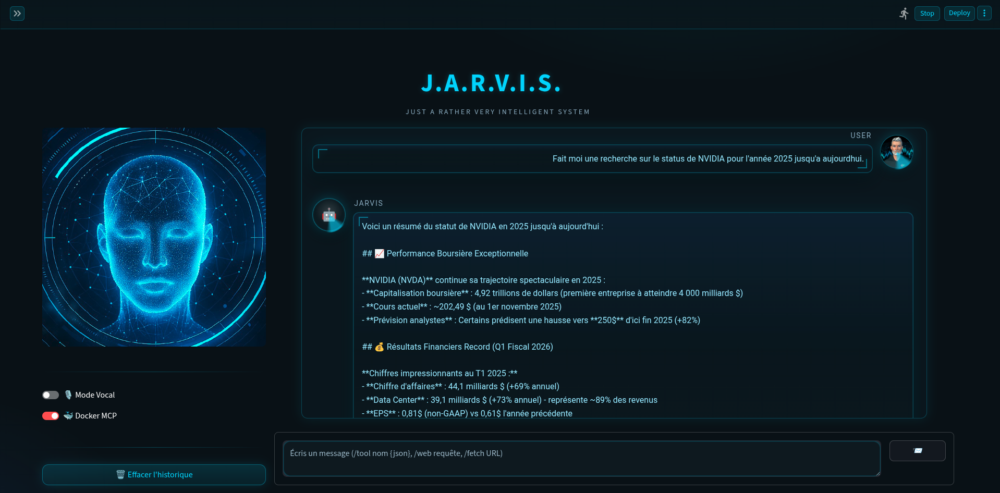

# Jarvis — UI Streamlit pour assistant vocal local



Jarvis est une interface Streamlit qui pilote un assistant vocal local. Elle orchestre la reconnaissance vocale (Whisper / Faster-Whisper), la synthèse vocale (Piper), la génération via Ollama et le Docker MCP Toolkit pour appeler des tools. Tout est pensé pour un usage sur machine personnelle : aucune donnée ne quitte votre poste.

---

## ✨ Points clés

- **Interface JARVIS HUD** : style holographique cyan avec avatars animés, radar vocal et effets visuels futuristes
- **Topbar de statut** : visualisez en un coup d'œil l'état de Whisper, Piper, Ollama, Docker MCP et ONNX Runtime
- **Radar vocal animé** : composant HTML/JS isolé rendu via `st.components.v1.html` qui réagit aux réponses de l'assistant et au mode (chat ou vocal)
- **Chat enrichi** : conversation texte avec mémoire, raccourcis `/web`, `/fetch`, `/tool` pour appeler des tools MCP
- **Mode vocal** : basculez en un clic vers une interaction mains libres, synchronisée avec le backend `jarvis.py`
- **Pilotage du backend local** : démarrez/arrêtez `jarvis.py`, synchronisez les paramètres (variables d'environnement) et consultez ses logs
- **Ollama intégré** : test de connectivité, téléchargement (`ollama pull`) et warmup de modèles, tool-calling natif
- **Docker MCP Toolkit** : intégration avec MCP servers via conteneurs Docker pour accès à des tools externes
- **Persistance automatique** : configuration sauvegardée sous `~/.jarvis/ui_config.json` et rechargée au lancement

---

## 🧰 Prérequis

- Python **3.11** (recommandé)
- [Ollama](https://ollama.com/) installé localement avec les modèles souhaités
- [Piper TTS](https://github.com/rhasspy/piper) et au moins une voix `.onnx` (copiée dans `~/.jarvis/voices`)
- [Docker](https://www.docker.com/) pour utiliser le Docker MCP Toolkit (optionnel mais recommandé)
- Accès audio (micro + sortie) si vous exploitez le mode vocal via `jarvis.py`

Toutes les dépendances Python nécessaires sont listées dans `requirements.txt` (Streamlit, Faster-Whisper, Piper-TTS, Ollama SDK, MCP SDK, etc.).

---

## 🚀 Installation rapide

```bash
# 1) Cloner le dépôt
git clone https://github.com/<votre_compte>/Streamlit_JARVIS.git
cd Streamlit_JARVIS

# 2) Créer un environnement virtuel (optionnel mais recommandé)
python -m venv .venv
source .venv/bin/activate  # sous Windows : .venv\Scripts\activate

# 3) Installer les dépendances Python
pip install --upgrade pip
pip install -r requirements.txt

# 4) Lancer l'interface Streamlit
streamlit run app.py
```

> 💡 **CUDA / GPU** : le projet s'appuie sur `onnxruntime` CPU par défaut pour Piper TTS. Ollama gère CUDA indépendamment via llama.cpp. Si vous souhaitez utiliser GPU pour Piper, installez manuellement `onnxruntime-gpu` et remplacez la dépendance.

---

## 🗂️ Organisation du dépôt

```
.
├── app.py              # Interface Streamlit principale (style JARVIS HUD)
├── jarvis.py           # Backend audio local (Whisper + Piper + logique vocale)
├── jarvis_ui_style.py  # Module CSS/HTML pour le style JARVIS HUD
├── requirements.txt    # Dépendances Python
├── scripts/
│   ├── install_dependencies.sh
│   ├── run_tests.sh
│   └── validate_gpu_setup.sh
├── docs/
│   └── interface.png
├── README.md           # Ce fichier
├── CLAUDE.md           # Instructions pour Claude Code
└── ANALYSE.md          # Analyse qualité du code
```

---

## ⚙️ Configuration & persistance

La configuration utilisateur est stockée dans `~/.jarvis/ui_config.json`. Elle est fusionnée avec les valeurs par défaut et normalisée vers la structure Docker MCP. Exemple de contenu :

```json
{
  "whisper": {
    "model": "small",
    "lang": "fr",
    "vad": true,
    "device": "cpu",
    "compute": "int8",
    "prompt": "Transcris strictement en français."
  },
  "piper": {
    "base_dir": "~/.jarvis/voices",
    "voice": "fr_FR-siwis-medium.onnx",
    "speaker_id": 0,
    "speed": 0.9,
    "noise": 0.667,
    "noise_w": 0.8,
    "sentence_silence": 0.1,
    "use_cuda": false
  },
  "ollama": {
    "host": "http://127.0.0.1:11434",
    "model": "qwen2.5:latest",
    "temperature": 0.7,
    "num_ctx": 4096,
    "stream": false
  },
  "llm": {
    "system_prompt": "Tu es JARVIS, un assistant francophone...",
    "use_ollama_tools": true,
    "agent_enabled": false
  },
  "mcp": {
    "docker": {
      "enabled": true,
      "docker_cmd": "docker",
      "auto_web": false,
      "auto_web_topk": 5,
      "chat_shortcuts": true
    }
  },
  "jarvis": {
    "path": "./jarvis.py",
    "audio_out": "analog",
    "tts_engine": "piper",
    "tts_lang": "fr",
    "wake_word": "jarvis",
    "wake_aliases": "",
    "require_wake": true,
    "wake_fuzzy": true,
    "wake_fuzzy_score": 80
  }
}
```

Chaque sauvegarde depuis l'UI synchronise également les variables d'environnement (`FW_MODEL`, `PIPER_VOICE`, `OLLAMA_HOST`, etc.) pour le backend `jarvis.py`.

---

## 🧑‍💻 Utilisation

1. **Lancer l'UI** via `streamlit run app.py`
2. **Configurer les onglets "Settings"** :
   - **Whisper** : modèle STT, langue, VAD, device (CPU/CUDA)
   - **Piper** : voix TTS, vitesse, bruit, speaker_id
   - **Ollama** : host, modèle LLM, température, contexte
   - **MCP** : activer Docker MCP, raccourcis chat, auto-web
   - **Jarvis** : chemin backend, sortie audio, wake word
3. **Démarrer Jarvis** depuis l'onglet "Interface" (boutons démarrer/arrêter). Les logs du backend apparaissent en temps réel
4. **Interagir** :
   - Mode **chat** : saisissez vos messages, utilisez les raccourcis :
     - `/web <requête>` : recherche web via Docker MCP
     - `/fetch <url>` : récupérer le contenu d'une URL
     - `/tool <nom> {json}` : appeler un tool MCP directement
   - Mode **vocal** : activez le toggle, puis parlez (backend requis pour capturer l'audio et répondre via Piper)
5. **Superviser** via la topbar (statuts), le radar vocal et les logs backend

---

## 🔎 Intégration Docker MCP

Le Docker MCP Toolkit permet d'utiliser des MCP servers (Model Context Protocol) via conteneurs Docker sans installation complexe.

### Configuration

- **Activé par défaut** : `mcp.docker.enabled = true`
- **Commande Docker** : `docker` (peut être chemin absolu si non dans PATH)
- **Auto-web** : désactivé par défaut (force le modèle à choisir explicitement les tools)
- **Raccourcis chat** : activés par défaut (`/web`, `/fetch`, `/tool`)

### Raccourcis disponibles

```bash
# Recherche web
/web Comment installer Docker sur Ubuntu

# Récupérer une page web
/fetch https://docs.docker.com

# Appeler un tool MCP directement
/tool get-library-docs {"library": "asyncio"}
```

### Prérequis Docker

```bash
# Vérifier que Docker est installé
docker --version

# Tester l'accès Docker
docker ps

# Si erreur de permissions (Linux) :
sudo usermod -aG docker $USER
# Puis redémarrer la session
```

---

## 🛠️ Dépannage

- **Ollama KO** : vérifiez que `ollama serve` tourne (`app.py` peut lancer le daemon si besoin) et que l'URL correspond
- **Voix Piper introuvable** : importez vos `.onnx` via l'onglet Piper ou copiez-les dans `~/.jarvis/voices`, puis sélectionnez-les
- **Docker MCP injoignable** : vérifiez que Docker est installé et que votre utilisateur a accès au daemon Docker
- **CUDA absente** : laissez `use_cuda` désactivé pour Piper et restez sur `onnxruntime` CPU. Ollama gère CUDA indépendamment
- **Erreur "permission denied" Docker** : ajoutez votre utilisateur au groupe docker (voir ci-dessus)

---

## 🎨 Interface JARVIS HUD

L'interface utilise un style holographique inspiré de JARVIS (Iron Man) :

- **Palette cyan/bleu** : couleurs néon sur fond sombre
- **Grille holographique** : effet de grille animée en arrière-plan
- **Avatars circulaires** : avec halos lumineux et anneaux rotatifs
- **Messages chat** : bulles avec coins "bracket" style HUD
- **Radar vocal** : animation circulaire réagissant à l'assistant
- **Scrollbar custom** : style JARVIS pour la fenêtre de chat

Le style est défini dans `jarvis_ui_style.py` et injecté via `inject_jarvis_css()`.

---

## 🤝 Contribuer

Les issues et PR sont les bienvenues. Pensez à préciser :
- OS et version Python
- Version d'Ollama
- Logs pertinents (`~/.jarvis/mcp-logs/`)
- Configuration MCP Docker (`docker ps`, `docker --version`)

---

## ✅ Tests rapides

Un script minimal est fourni pour vérifier que les modules principaux se compilent correctement :

```bash
# Tests de syntaxe
scripts/run_tests.sh

# Ou manuellement
python -m py_compile app.py jarvis.py jarvis_ui_style.py
```

Le script échoue immédiatement si la compilation détecte une erreur de syntaxe.

---

## 📝 Architecture technique

### Deux processus

- **app.py** (Streamlit UI) : interface utilisateur, gestion config, contrôle du backend
- **jarvis.py** (subprocess) : daemon audio, STT/TTS, wake word detection

### Communication

- **UI → Backend** : variables d'environnement avant spawn
- **Backend → UI** : logs stdout avec marqueurs `[INFO]`, `[ASSISTANT]`, `[USER]`, `[VU]`

### Stack

- **STT** : Faster-Whisper (CPU, modèles small/medium/large)
- **TTS** : Piper (ONNX, CPU par défaut, GPU optionnel)
- **LLM** : Ollama (local, CUDA via llama.cpp)
- **MCP** : Docker MCP Toolkit (conteneurs Docker)
- **UI** : Streamlit + HTML/CSS/JS custom

### Architecture hybride CPU/GPU

- **Audio/STT/TTS** : CPU (onnxruntime)
- **LLM** : GPU (Ollama gère CUDA indépendamment)
- **Pas de conflit** : piles ONNX et CUDA séparées

---

## 📝 Licence

Projet distribué sous licence MIT (`LICENSE`).
